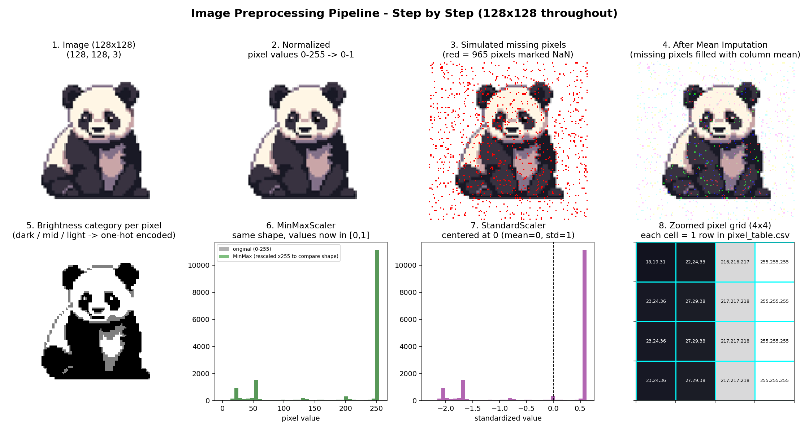
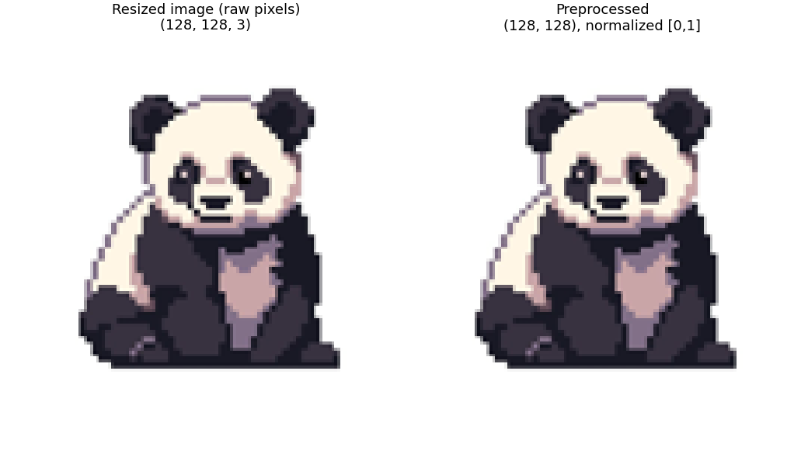
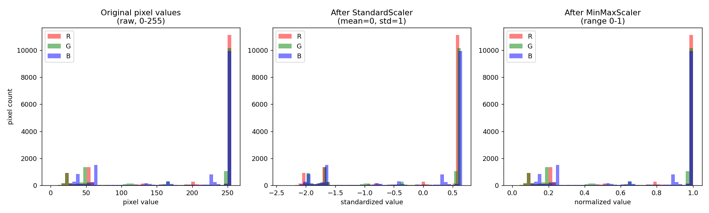

# Lab 03 — Image Data Preprocessing

Lab task on image data handling and preprocessing (loading, resizing,
normalization, missing/corrupted data handling, tabular conversion,
one-hot encoding) and feature scaling (StandardScaler / MinMaxScaler),
using a single 128x128 panda image as the dataset.

## Files

- `task1_image_preprocessing.py` — load, explore, resize (128x128), normalize,
  handle missing/corrupted images, mean-impute simulated missing pixels,
  convert the image into a tabular pixel dataset, one-hot encode a
  categorical `brightness` column, and visualize original vs preprocessed.
- `task2_feature_scaling.py` — apply `StandardScaler` and `MinMaxScaler` to
  the tabular pixel data and visualize the pixel-value distributions before
  and after scaling.
- `view_preprocessing_pipeline.py` — generates a single image
  (`outputs/preprocessing_pipeline_view.png`) showing every pipeline step
  side by side, for a quick visual walkthrough/demo.
- `generate_lab_journal.py` — builds a Word document lab journal
  (`outputs/Lab03_Journal_Image_Preprocessing.docx`, not tracked in this repo)
  combining the code and outputs, ready to submit.
- `dataset/panda_original.jpg` — the source image used as the dataset.
- `outputs/` — generated results (resized image, CSVs, comparison figures,
  console logs).

## Output Screenshots

### Task 1 — Image Preprocessing

**Full pipeline, step by step** (resize → normalize → simulated missing
pixels → mean imputation → brightness categories → scaling → pixel grid):



**Resized (raw) vs preprocessed (normalized) image:**



### Task 2 — Feature Scaling

**Pixel-value distributions before/after StandardScaler and MinMaxScaler:**



## Run order

```bash
python task1_image_preprocessing.py
python task2_feature_scaling.py
python view_preprocessing_pipeline.py
python generate_lab_journal.py
```

## Requirements

```
numpy
pandas
pillow
matplotlib
scikit-learn
python-docx
```
